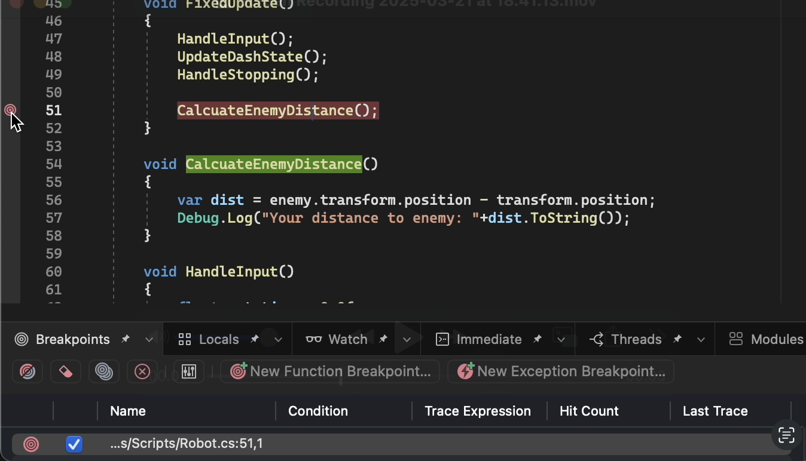
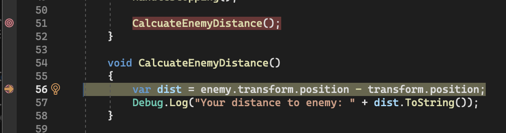
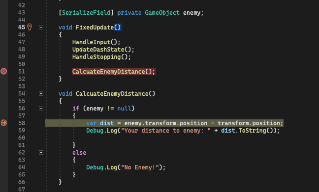
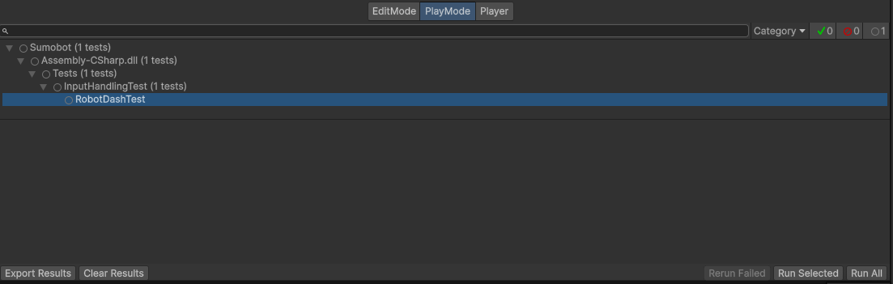
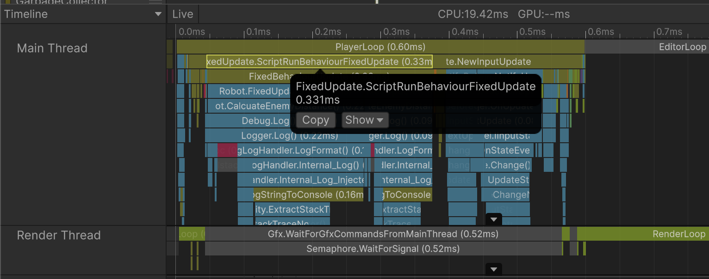
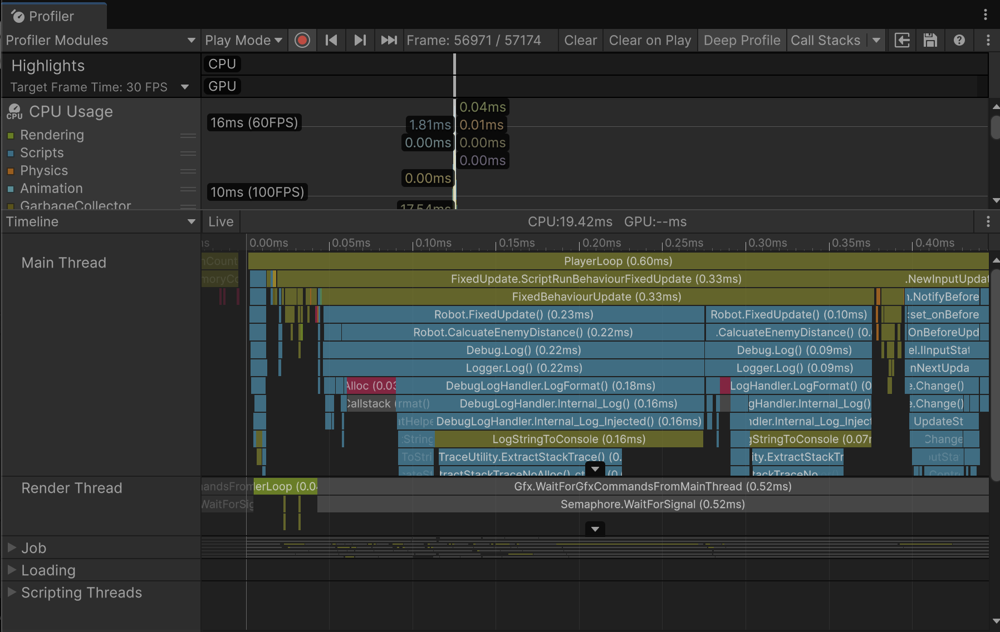

## Debug, Test, And Profiling

In order to develop Sumobot, we want to know that our codes are not troubling users by using Debugging and Testing. As well for the performance, memory allocation, and optimization we rely on Profiling.

### Preparing with Visual Studio 2022

from the very first-time Unity released, Visual Studio 2022 was the IDE that supports Unity in Development Game. If you are using Visual Studio Code, it's okay to follow our guideline because the approach is quite similar.

To start, you can follow this steps:

1. Make sure that your Unity has installed *Visual Studio Editor* (Window -> Package Manager)
2. Set External Script Editor with Visual Studio (Unity -> Settings/Preferences -> External Tools -> External Script Editor)   
3. Open Script Editor (Right click on Assets folder -> Open C# Project)
4. You can see that Visual Studio 2022 has successfully attached with our Unity runtime
5. Last step, enable Development Build & Script Debugging in Unity (File -> Build Profiles / Build Settings)

Now you must seen Debugger Attached indicator in Unity in the Bottom-Right of the window, meaning we are successfuly setup Unity's Script Editor. Let's jump with our main topics.

### Debugging

Debugging is an essential part when it comes to software & game development. Because, to know our code works with our minimal expectations is by debugging. When there's error, we gather what possibilities that make the error occured is by debugging. 

Sometimes we dont know what causes the error occured, so we can put any breakpoints in the relevant context. Let's say we have a problem in using a null variable that supposed to be a game object.

I've already created a nullable game object named `enemy`, and I want to use it to calculate the distance between the enemy and Player in Robot.cs

    [SerializeField] private GameObject enemy;

    void FixedUpdate()
    {
        HandleInput();
        UpdateDashState();
        HandleStopping();

        CalcuateEnemyDistance();
    }

    public void CalcuateEnemyDistance()
    {
        var dist = enemy.transform.position - transform.position;
        Debug.Log("Your distance to enemy: " + dist.ToString());
    }

Run the program, and we will get UnassignedReferenceExeception at enemy variable.

`UnassignedReferenceException: The variable enemy of Robot has not been assigned.`

What if the problem is actually more complex than a null variable?, we can use Breakpoints. Let's dig deeper.

At the line of 51, we add a Breakpoint by clicking in the left side of line numbers

If we Run the game, it will stopped just straight into the breakpoints that we added at that line 51, you can see the indicator that the breakpoint is reached by yellow arrow-right icon

**Let's fix and test it while running the Unity**

1. Add new Breakpoint at the line that got affected (line 56), so we can step up and step in while running Unity. 

2. Then press Continue Debugging, Unity will be stopped and moved to the line 56 as the problem occured

    

3. Fix by adding conditional if-else case, which checking the enemy game object whether it's null or not.

    

4. Since C# is compiled programming language, we have to Restart Debugging to apply the changes we made to Unity.
5.  Run then we will see the "No Enemy!" is printed, meaning the error is solved
   
        No Enemy!
        UnityEngine.Debug:Log (object)
        Robot:CalcuateEnemyDistance () (at Assets/Scripts/Robot.cs:69)
        Robot:FixedUpdate () (at Assets/Scripts/Robot.cs:57)

### Testing

After we've done with our code, we need to test our code to match our expectations. Imagine developing a small function and it's used by many references, or the usability is in the deep of game flow that you have to Run the game and come over the function just to test it. It's painful apparently when it's actually repeating. 

With testing we can shorthen the phase of debugging using Unit Testing. In this case, I've created InputHandlingTest class which covers player's input values in order to move their robots. Let's create for the Dash() behaviour.

1.  In order to create a testing, we have to prepare "Tests" folder under "Scripts" folder
2.  Then create InputHandlingTest and a function that similar to the real function. In this case, I named "RobotDashTest()"

    [Test]
    public void RobotDashTest()
    {
        var robot = new GameObject()
        .AddComponent<Rigidbody2D>()
        .AddComponent<Robot>();

        robot.Initalize();

        robot.GetComponent<Rigidbody2D>().linearVelocity = Vector2.zero;

        Assert.AreEqual(new Vector2(0, 10f), robot.Dash());
    }

Then we can open Test Runner from Unity (Window -> General -> Test Runner) to test. Click Run All to test all the test codes we've created but in this case we only have one.

.

You will see the test would be passed since we've already know that `robot.Dash()` has return of `transform.up * dashSpeed` which is Vector(0,10f)

### Profiling

As per the official documentation, Visual Studio 2022 in Mac doesn't support profiling (Diagnostic Tools window), If you are using Mac device, Unity Profiler can be a solution to look at the allocation and performance of Sumobot Game.

To start profiling, you can open through Window -> Analysis -> Profiler. Run the game, and you can see graphics of movement allocation data per frame.

For example, Im curious about functions inside Robot.cs, how much time that the functions inside Robot.cs is handled by our hardware, then we can optimize the code.

Click on the FixedUpdate.ScriptRunBehaviourFixedUpdate usage inside Main Thread, and press F

Then you will see the expanded views of which functions are taken in such time

